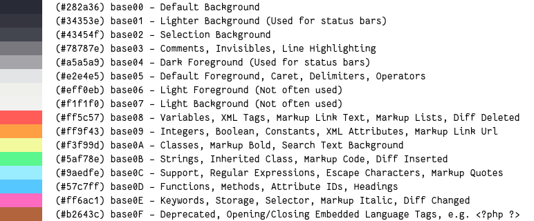

# base16-snazzy-scheme

> Elegant [base16] theme with bright colors

[![license][license-badge]](LICENSE)



This is a color scheme for base16. The colors are chosen from the original [hyper-snazzy] version, and follows the styling guidelines from [base16]. This scheme lets you use the snazzy colors on any application supported by base16.

**NOTE**: the definition file in this repository is for the original [base16]
specification. This color scheme is also synced to the [Tinted Theming] project.

## How to install and use this color scheme

This is a base16 color scheme definition. To use it on an application you need to
install the generated theme file for that application from a place/repository or
via a base16 plugin of the application, that contains the generated theme files.

### Examples

For example, you can import and use this color scheme on Windows Console by installing
the [concfg] tool and import this color scheme from the [base16-concfg] repository.

``` powershell
concfg import https://raw.githubusercontent.com/chawyehsu/base16-concfg/master/presets/base16-snazzy.json
```

Here is another example to use `base16-snazzy` on **Vim** with Vundle. Simply
add the following code into your `~/.vimrc` file and run `PluginInstall` in Vim.

``` vim
Plugin 'chriskempson/base16-vim'
```

Then add `colorscheme base16-snazzy` to your `~/.vimrc`. For more information,
please refer to [base16-vim] and the successor project [tinted-vim].

## Related

- [hyper-snazzy] - Hyper version
- [iterm2-snazzy](https://github.com/sindresorhus/iterm2-snazzy) - iTerm2 version
- [terminal-snazzy](https://github.com/sindresorhus/terminal-snazzy) - Terminal version
- [konsole-snazzy](https://github.com/miedzinski/konsole-snazzy) - Konsole version
- [vscode-snazzy](https://github.com/Tyriar/vscode-snazzy) - VS Code version
- [emacs-snazzy](https://github.com/weijiangan/emacs-snazzy) - Emacs version
- [termite-snazzy](https://github.com/kbobrowski/termite-snazzy) - Termite version
- [deepin-snazzy](https://github.com/xxczaki/deepin-snazzy) - Linux Deepin terminal version
- [kitty-snazzy](https://github.com/connorholyday/kitty-snazzy) - Kitty version
- [gnome-terminal-snazzy](https://github.com/tobark/hyper-snazzy-gnome-terminal) - Gnome terminal version
- [urxvt-snazzy](https://github.com/LeonGr/urxvt-snazzy) - Urxvt version
- [alacritty-snazzy](https://github.com/alebelcor/alacritty-snazzy) - Alacritty version
- [tilix-snazzy](https://github.com/clrxbl/tilix-snazzy) - Tilix version
- [terminus-snazzy](https://github.com/ThibzR/terminus-snazzy) - Terminus version
- [windows-terminal-snazzy](https://github.com/Richienb/windows-terminal-snazzy) - Windows Terminal version
- [alfred-snazzy](https://github.com/zeitchef/alfred-snazzy) - Alfred version
- [warp-snazzy](https://github.com/GrimLink/warp-theme-snazzy) - Warp version
- [tmux-snazzy](https://github.com/ivnvxd/tmux-snazzy) - Tmux version

## License

**base16-snazzy-scheme** © [Chawye Hsu](https://github.com/chawyehsu). Released under the [MIT](LICENSE) license.

> [Blog](https://chawyehsu.com) · GitHub [@chawyehsu](https://github.com/chawyehsu) · Twitter [@chawyehsu](https://twitter.com/chawyehsu)

[license-badge]: https://img.shields.io/github/license/chawyehsu/base16-snazzy-scheme?style=flat&logo=spdx&logoColor=e2e4e5&colorA=282a36&colorB=f1f1f0
[Base16]: https://github.com/chriskempson/base16
[Tinted Theming]: https://github.com/tinted-theming/schemes
[concfg]: https://github.com/lukesampson/concfg
[base16-concfg]: https://github.com/chawyehsu/base16-concfg
[hyper-snazzy]: https://github.com/sindresorhus/hyper-snazzy
[base16-vim]: https://github.com/chriskempson/base16-vim
[tinted-vim]: https://github.com/tinted-theming/tinted-vim
