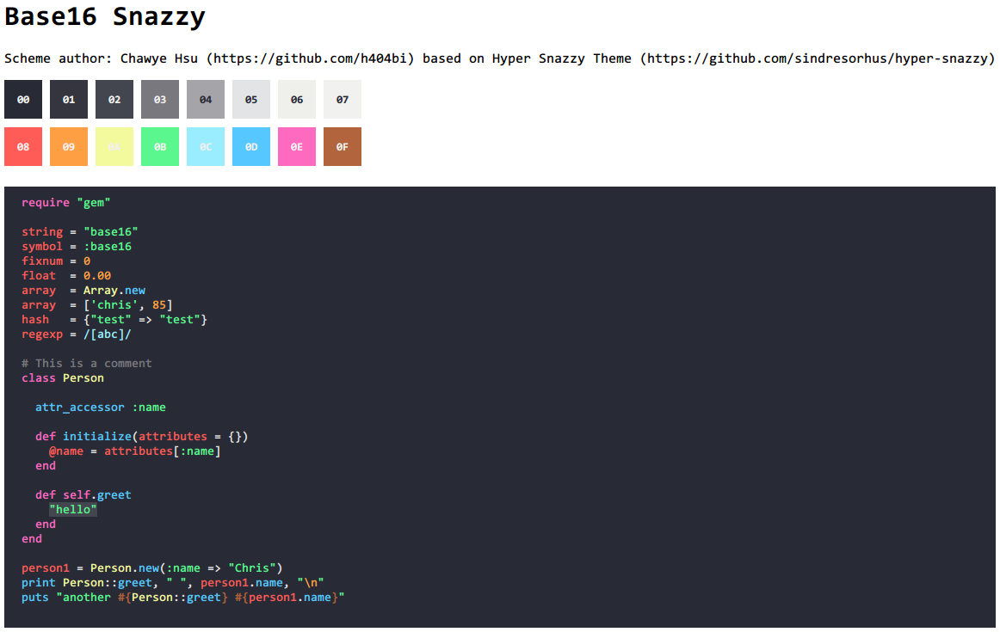

# base16-snazzy-scheme

> Elegant [base16](https://github.com/chriskempson/base16) theme with bright colors

This is a color scheme for base16. The colors are chosen from the original [hyper-snazzy](https://github.com/sindresorhus/hyper-snazzy) version, and follows the styling guidelines from [base16](http://chriskempson.com/projects/base16/). This scheme lets you use the snazzy colors on any application supported by base16.



## Install / How to use

This is a base16 color scheme definition. To use it on an application you want, you should take a look at [base16's repository](https://github.com/chriskempson/base16#template-repositories) to see if the application is supported by base16. Then choose a [base16 builder](https://github.com/chriskempson/base16#builder-repositories) to build the theme files of the application. It will generate a bunch of theme files based on different base16 color scheme definition. To use snazzy colors, just install the snazzy one into the application, and that's it!

Here is an example to use base16-snazzy on **Vim**:

**Vundle**

Add the following code into your `~/.vimrc` file and run `PluginInstall` in Vim.
```
Plugin 'chriskempson/base16-vim'
```
Then add `colorscheme base16-snazzy` to your `~/.vimrc`. *For details, see [base16-vim](https://github.com/chriskempson/base16-vim).*

## Related

- [hyper-snazzy](https://github.com/sindresorhus/hyper-snazzy) - Hyper version
- [iterm2-snazzy](https://github.com/sindresorhus/iterm2-snazzy) - iTerm2 version
- [terminal-snazzy](https://github.com/sindresorhus/terminal-snazzy) - Terminal version
- [konsole-snazzy](https://github.com/miedzinski/konsole-snazzy) - Konsole version
- [vscode-snazzy](https://github.com/Tyriar/vscode-snazzy) - VS Code version
- [emacs-snazzy](https://github.com/weijiangan/emacs-snazzy) - Emacs version
- [termite-snazzy](https://github.com/kbobrowski/termite-snazzy) - Termite version
- [deepin-snazzy](https://github.com/xxczaki/deepin-snazzy) - Linux Deepin terminal version
- [kitty-snazzy](https://github.com/connorholyday/kitty-snazzy) - Kitty version
- [gnome-terminal-snazzy](https://github.com/tobark/hyper-snazzy-gnome-terminal) - Gnome terminal version
- [urxvt-snazzy](https://github.com/LeonGr/urxvt-snazzy) - Urxvt version

## License

MIT © [Chawye Hsu](https://h404bi.com)
